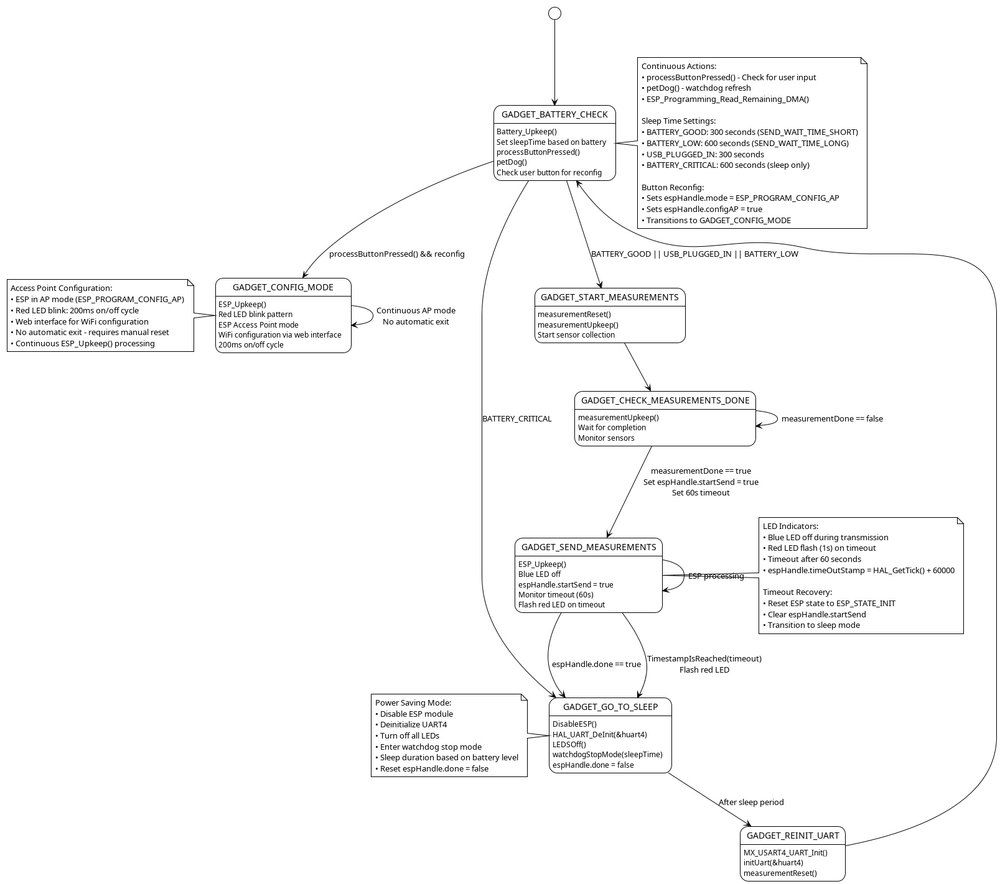
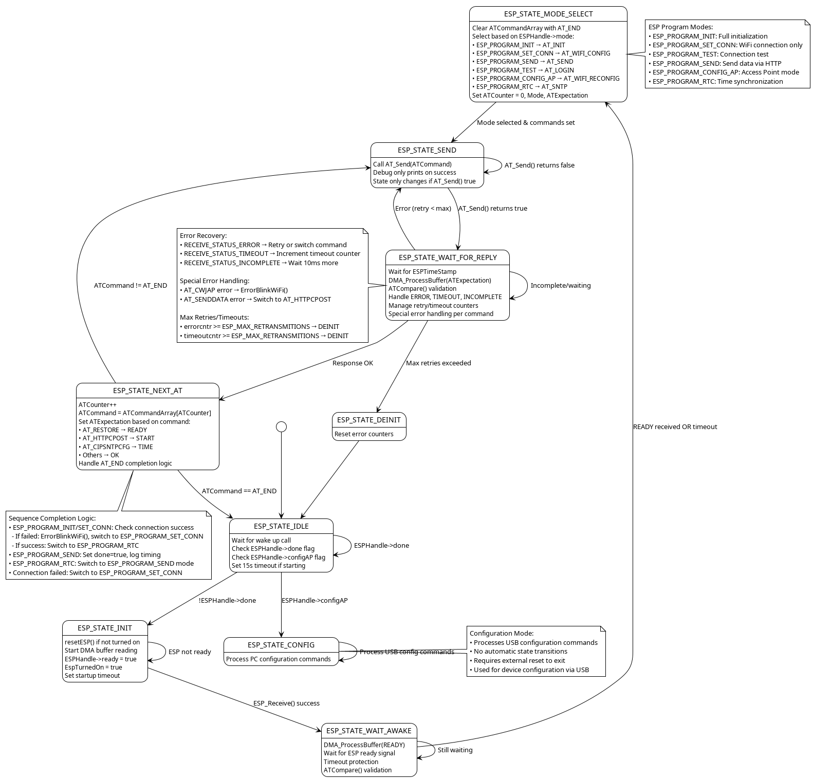
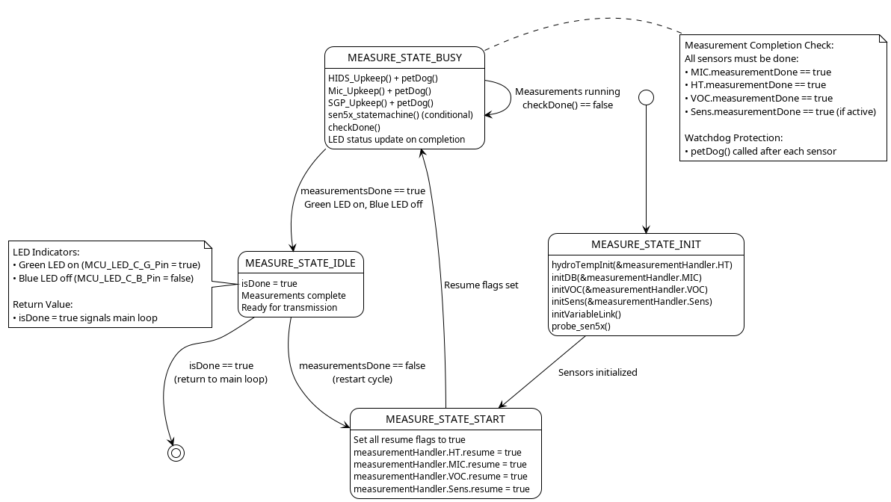

# WOS-Gadget

Forked from: http://github.com/kittengineering/Omgevingsmonitor_Software


| Constrols | | | |
|---------|:--------:|-----:|-----:|
| LED     |   Status | dB   | VOC  |
| Buttons |    RESET | BOOT | USER |


Press BOOT + USER button during start up -> Process PC Config

Press USER button during start up -> Start Wifi config AP


## Getting started

Reference: https://wiki.deomgevingsmonitor.nl/index.php/Programmeeromgeving

Install [STM32CubeProgrammer](https://www.st.com/en/development-tools/stm32cubeprog.html#get-softwarehttps://www.st.com/en/development-tools/stm32cubeprog.html#get-software)

Follow the wizard
```
./stm32cubeprg-lin-v2-20-0/SetupSTM32CubeProgrammer-2.20.0.linux 
```

## State diagram

### Main State


### ESP upkeep State


### Measurement State


### Diagrams
Requirements to view PlantUML diagrams:
- Java
- graphviz
```
sudo apt install graphviz
```
- VSCode extention: [PlantUML](https://marketplace.visualstudio.com/items?itemName=jebbs.plantuml)


## Compiling
Compile the program with either STM32CubeIDE or command line.

### 1. STM32CubeIDE

    1. Open STM32CubeIDE
    2. Import the project:
        - File → Import → General → Existing Projects into Workspace
        - Browse to wos-gadget
        - Select the project and click Finish
    3. Build the project:
        - Right-click on project → Build Project
        - Or use Ctrl+B
        - Or click the hammer icon in the toolbar
    
    4. Manage Embedded Software Packages
        - Install `STM32CubeL0` version `V1.12.2` which install package in `STM32Cube/Repository/STM32Cube_FW_L0_V1.12.2`

### 2. Commnand line
```
cd build
cmake ..
make
```

## Deploying

Start the STM32CubeProgrammer select `build/MSJGadget*.elf` 
Press middle (Reset) and right (Boot) button. Let go of the right button first. 
Upload the firmware with 'Download'.  
Press 2x reset 

## Connecting

```
gtkterm -p /dev/ttyACM0 -s 115200
```

# Troubleshoot

## compiling in Linux
`fatal error: String.h: No such file or directory`

Change '#include <String.h>' to '#include <string.h>
Change '#include "EEprom.h"' to '#include <EEProm.h>
Change '#include "GPIO.h"' to '#include "gpio.h"'
